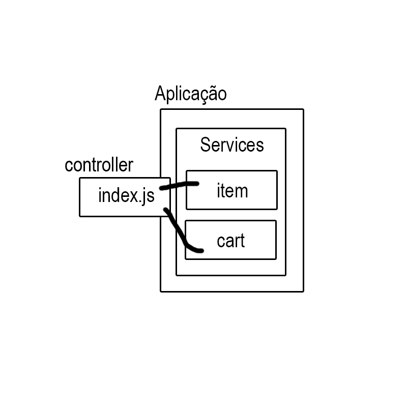

# Projeto de Criação de um Carrinho de Compras usando Node.js

Repositório contendo o código desenvolvido durante um bootcamp de Node.js, com foco na criação das principais funcionalidades de um carrinho de compras online. O objetivo foi implementar essas funções utilizando Node.js de forma eficiente.

## Estrutura do Projeto

src 
├── img 
│ └── arquitetura.jpg 
├── services 
│ ├── carts.js 
│ └── itens.js 
├── index.js 
└── package.json README.md

# Funções da Estrutura do Projeto

## `src/services/carts.js`
Este arquivo contém as funções relacionadas ao gerenciamento do carrinho de compras, incluindo:

- **addItem**: Adiciona um item ao carrinho.
- **deleteItem**: Remove um item do carrinho com base no nome.
- **removeItem**: Remove um item do carrinho com base no índice.
- **calculeTotal**: Calcula o total do carrinho, somando os subtotais dos itens.

## `src/services/itens.js`
Este arquivo define a função para criação de itens, incluindo:

- **createItem**: Cria um novo item com propriedades como nome, preço, quantidade, um método para calcular o subtotal, entre outras entrdas.

## `src/index.js`
Este arquivo é o ponto de entrada do aplicativo, onde:

- Inicializa o carrinho de compras.
- Exibe mensagens de boas-vindas.
- Cria itens e adiciona ao carrinho.
- Calcula e exibe o total do carrinho.

## Imagem da Arquitetura do Projeto

